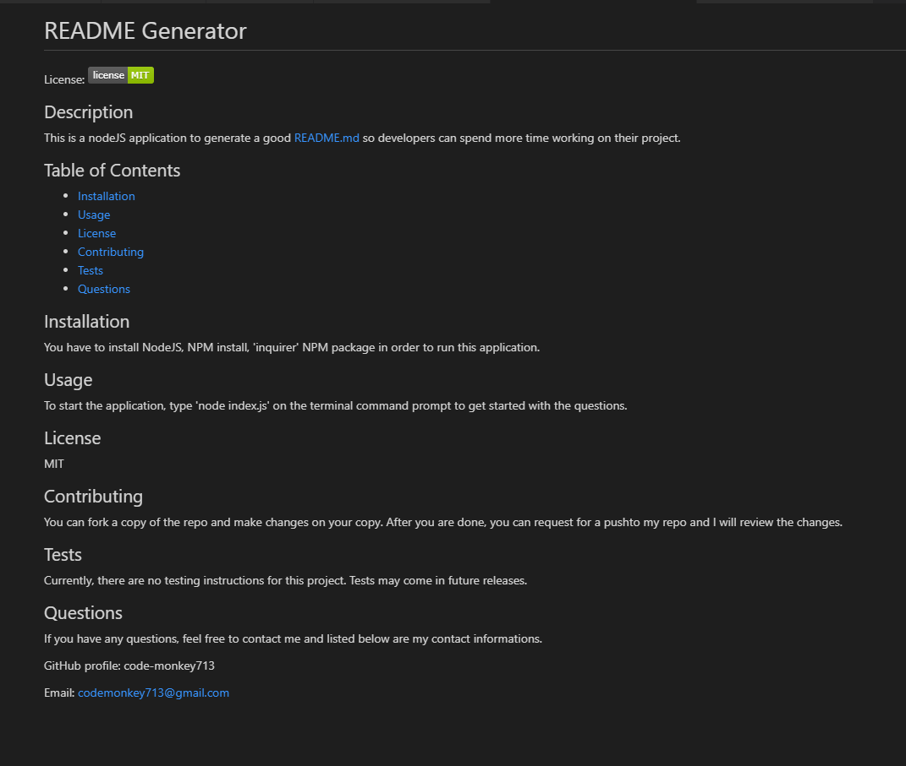

# README Generator

License: 

## Description 

This is a nodeJS application to generate a good README.md so developers can spend more time working on their project.

## Table of Contents

* [Installation](#installation)
* [Usage](#usage)
* [License](#license)
* [Contributing](#contributing)
* [Tests](#tests)
* [Questions](#questions)

## Installation

You have to install NodeJS, NPM install, 'inquirer' NPM package in order to run this application.

## Usage 

To start the application, type 'node index.js' on the terminal command prompt to get started with the questions. 

Here is a link to a video walk-through of the application at work. 

https://drive.google.com/file/d/1Xr8zw1MHKQioMfNzPQxz9_32Q7-f9NT-/view?usp=sharing

## License

MIT

## Contributing

You can fork a copy of the repo and make changes on your copy. After you are done, you can request for a pushto my repo and I will review the changes.

## Tests

Currently, there are no testing instructions for this project. Tests may come in future releases. 

## Questions

If you have any questions, feel free to contact me and listed below are my contact informations. 

GitHub profile: code-monkey713

Email: codemonkey713@gmail.com

